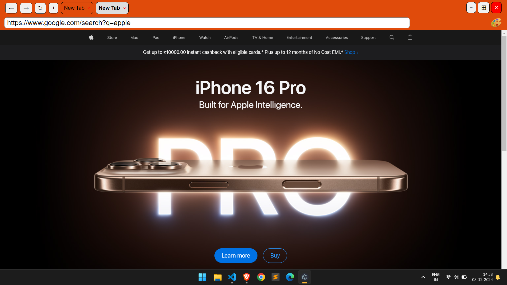

# **my browser**

A modern Electron application built with the **Electron Forge Vite template** for rapid development and performance.





## **Features**

- Cross-platform desktop application (Windows, macOS, Linux)
- Built using **Electron**, **Vite**, and **JavaScript/TypeScript**
- Simple and efficient tab-based browser functionality
- Built-in loading animations
- Custom color picker functionality
- URL validation and Google search integration

---

## **Getting Started**

### **Prerequisites**

Make sure you have the following installed on your system:

- [Node.js](https://nodejs.org/) (v16 or higher)
- [npm](https://www.npmjs.com/)

---

### **Installation**

1. Clone the repository:
   ```bash
   git clone https://github.com/pradeepjoshi6002/autoflow-fullstack-assignment
   ```
2. install node modules:
   ```run
   **npm i**
   ```
3. dev-mode:
   ```run
   **npm run start**
   ```
   build-mode:
   ```run
   **npm run make**
   ```
